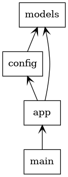
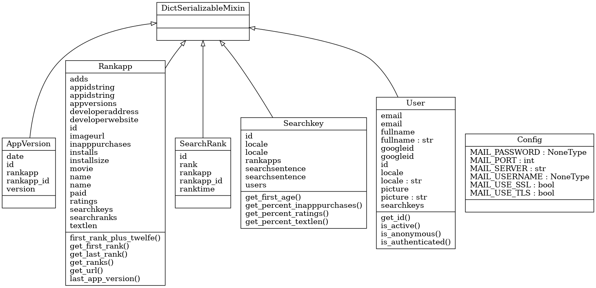

# 1 Apprank
This project is a webtool that will display the ranks of several apps on the appstore.
You can input search keywords that will later trigger searches on the google playstore.
the results of these searches will display the apps associated with the search keys in a ranked order.
The rank will be saved so it can be determined how the rank of an app chnages over time.

# 2 Structure
It is a flask websites and i beleve it is a typycal flask directory structure.
However lets describe them anyway:
/alembic  version controll for the database
/assets thins like css, javascript and images
/cronscripts this is a bit special, it are the cronscripts that will scrape the playstore etc
/dist the html templates
/lib additional python classes in the form of libs (now sure if it is typylal flask structure)
/tools handy python tools to fake a database, clean the db etc (also not a typical flask structure)
/translations

# 3.5 Things used

What html templates, javascript etc, am i using for the frondend etc?

Well:

# 3 How to run it

This software depends on `pipenv` how one does `pipenv` one can find here: [pipenv](https://docs.python-guide.org/dev/virtualenvs/)

Befor you can run this app in full and not in demo or developer mode you need to provide the SECRETS that are present in the config file. you need google oauth2 api for this and to generate the google oauth2 info.

I suggest you make a run.sh file with the example contents as follows:

`
export FLASK_APP=app
export FLASK_ENV=development
export SECRETKEY='???????'
export SECRETPASS='='???????''
export CLIENTID='='???????''
export CLIENTSECRET='='???????''
export RECAPCHASECRET='='???????''
export RECAPCHASITEKEY='='???????''
export MAILUSERNAME='='???????''
export MAILPASSWORD='='???????''

flask run  --host=0.0.0.0
`

make this file executable and run it.

As to run this project in a live environment, well that is a other story for another time.

# 4 Class diagram

A crude class diagramm that displays the main app diagram:

# 5 Packages used:

`sqlalchemy`
`faker`
`sqlalchemy-utils`
`authlib`
`flask-oauthlib`
`oauthlib`
`requests`
`flask-authlib-client`
`flask-login`
`toml`
`flask-cachecontrol`
`colour`
`selenium`
`pyvirtualdisplay`
`paste`
`cerberus`
`flask-mail`
`geckodriver-autoinstaller`
`alembic`
`google-play-scraper`
`pycodestyle`
`flake8`
